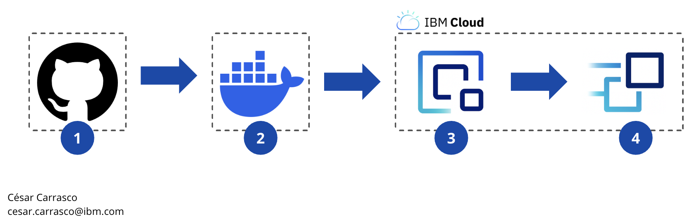
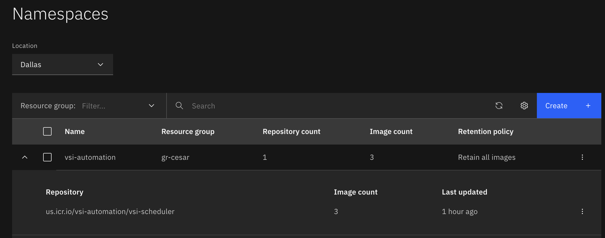
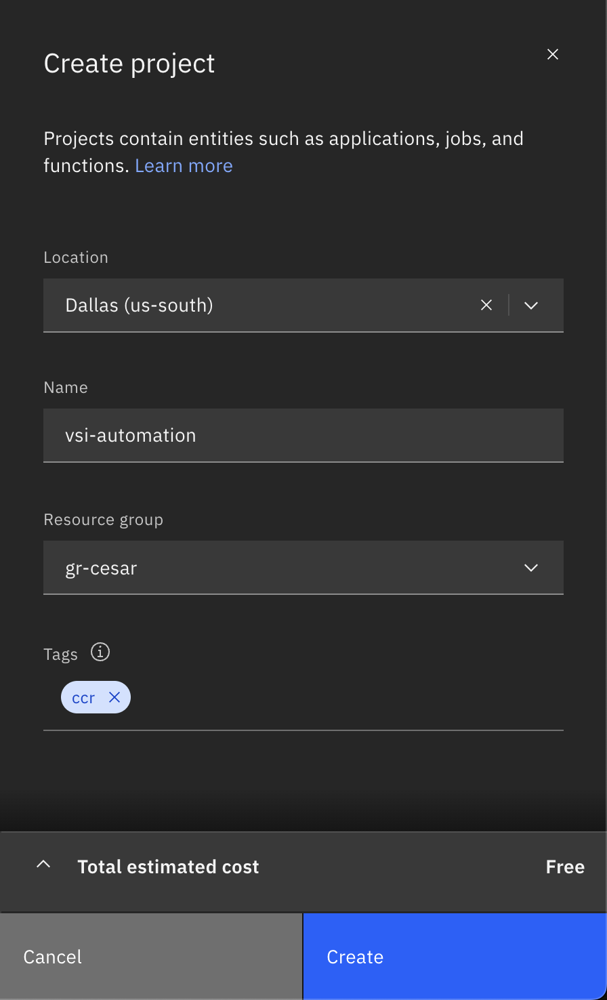
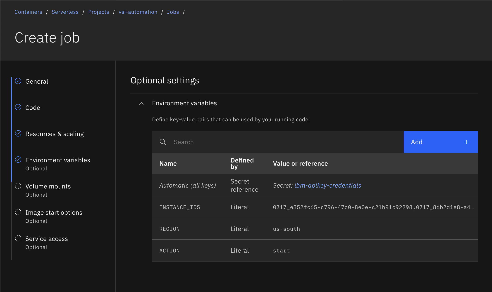
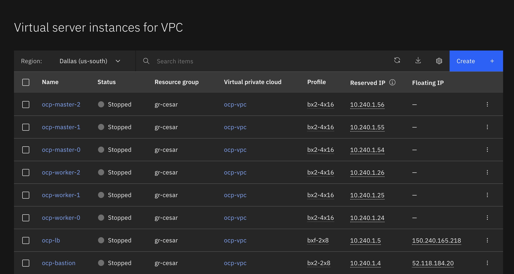
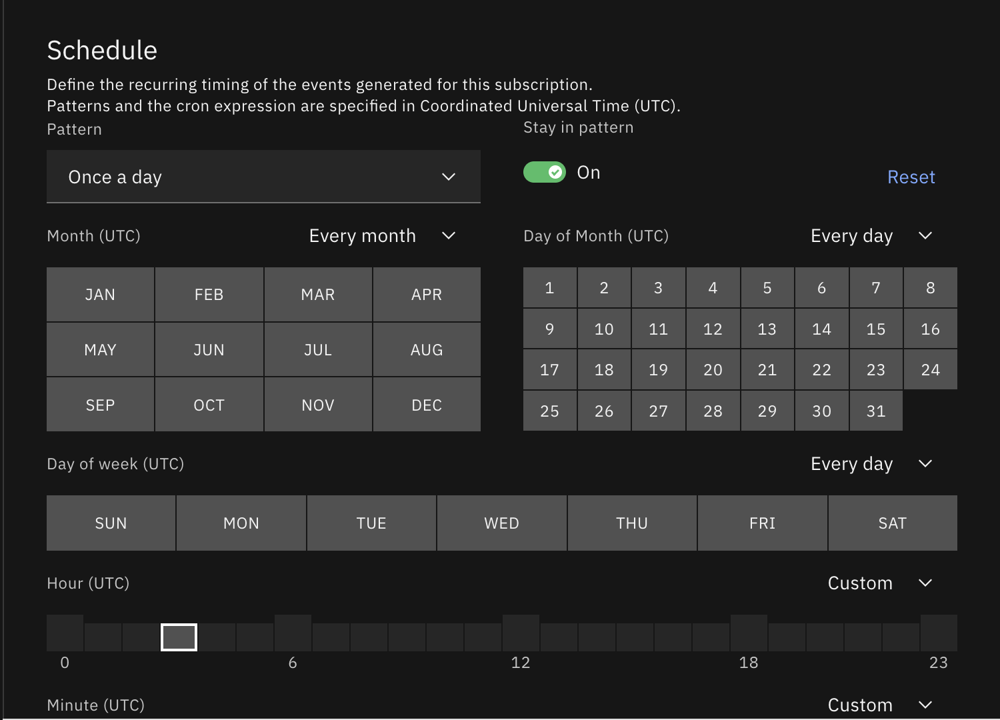

# Automatización de Instancias VSI en IBM Cloud con Code Engine

Esta guía documenta la implementación de una solución serverless para automatizar el encendido y apagado de Virtual Server Instances (VSI) en IBM Cloud VPC mediante Code Engine y Event Subscriptions programados.

## ¿Qué hace esta solución?

Permite programar horarios de encendido y apagado de instancias VSI automáticamente, optimizando costos al mantener las instancias activas solo cuando son necesarias (por ejemplo, horario laboral de lunes a viernes).

**Características principales:**
- Soporte para múltiples instancias simultáneamente
- Ejecución serverless (sin infraestructura que mantener)
- Programación flexible con expresiones cron
- Logs centralizados de cada ejecución

---

## Arquitectura de la Solución


*Flujo end-to-end desde desarrollo hasta ejecución automatizada*

### Componentes

| Componente | Función | Tecnología |
|------------|---------|------------|
| Source Repository | Control de versiones del código fuente | GitHub |
| Build Environment | Construcción de imágenes de contenedor | Docker Engine |
| Container Registry | Almacenamiento de artefactos | IBM Container Registry (us-south) |
| Orchestration Platform | Ejecución serverless y scheduling | IBM Code Engine |
| Target Infrastructure | Instancias a gestionar | IBM VPC Gen 2 |

---

## Prerrequisitos

### 1. Herramientas instaladas

- **IBM Cloud CLI** - [Guía de instalación](https://cloud.ibm.com/docs/cli?topic=cli-getting-started)
- **Docker Desktop** - [Descargar](https://www.docker.com/products/docker-desktop)
- **Git** - Para clonar el repositorio

Verificar instalación:
```bash
ibmcloud --version
docker --version
git --version
```

### 2. API Key con permisos

Crear una API Key desde la [consola de IBM Cloud](https://cloud.ibm.com/iam/apikeys) con los siguientes permisos mínimos:

| Servicio | Rol Requerido | Propósito |
|----------|---------------|-----------|
| VPC Infrastructure | Editor | Ejecutar acciones start/stop en VSIs |
| Code Engine | Writer | Crear jobs y secrets |
| Container Registry | Manager | Crear namespaces y push de imágenes |
| Resource Group | Viewer | Visualizar y targetear resource groups |

**Documentación:** [Gestión de API Keys](https://cloud.ibm.com/docs/account?topic=account-userapikey&interface=ui)

**⚠️ Importante:** Guarde la API Key de forma segura. Solo se muestra una vez al crearla.

### 3. IDs de instancias VSI

Identifique las instancias que desea automatizar:

**Opción 1 - Desde la consola:**
1. Acceda a [VPC Infrastructure → Virtual server instances](https://cloud.ibm.com/vpc-ext/compute/vs)
2. Click en cada instancia para ver su ID

**Opción 2 - Desde CLI:**
```bash
ibmcloud is instances
```

Anote los IDs de las instancias (formato: `0757_xxxxxxxx-xxxx-xxxx-xxxx-xxxxxxxxxxxx`)

### 4. Resource Group

Identifique el resource group donde trabajará:
```bash
# Listar resource groups disponibles
ibmcloud resource groups

# Targetear su resource group
ibmcloud target -g <nombre-resource-group>
```

---

## Implementación

### Paso 1: Clonar el repositorio

```bash
git clone https://github.com/Ceskard26/vsi-scheduler.git
cd vsi-scheduler
```

Estructura del repositorio:
```
vsi-scheduler/
├── instance_scheduler.py    # Script principal
├── Dockerfile                # Definición de imagen
├── requirements.txt          # Dependencias Python
└── README.md
```

---

### Paso 2: Construir la imagen Docker

```bash
# Construir imagen
docker build -t vsi-scheduler:latest .

# Verificar construcción exitosa
docker images vsi-scheduler
```

**Output esperado:**
```
REPOSITORY                                 TAG      DIGEST         SIZE
us.icr.io/vsi-automation/vsi-scheduler    latest   sha256:abc...  254 MB
```


---

### Paso 3: Subir imagen a Container Registry

#### 3.1 Configurar región y autenticación

```bash
# Configurar región Dallas
ibmcloud cr region-set us-south

# Login a Container Registry
ibmcloud cr login
```

#### 3.2 Crear namespace

**Importante:** Debe tener un resource group targeteado antes de crear el namespace.

```bash
# Si no tiene resource group targeteado
ibmcloud target -g <nombre-resource-group>

# Crear namespace
ibmcloud cr namespace-add vsi-automation
```

#### 3.3 Tag y push de la imagen

```bash
# Tag de la imagen
docker tag vsi-scheduler:latest us.icr.io/vsi-automation/vsi-scheduler:latest

# Push a Container Registry
docker push us.icr.io/vsi-automation/vsi-scheduler:latest

# Verificar imagen subida
ibmcloud cr images --restrict vsi-automation
```

**Output esperado:**
```
REPOSITORY                                 TAG      DIGEST         SIZE
us.icr.io/vsi-automation/vsi-scheduler    latest   sha256:abc...  254 MB
```

**[IMAGEN: registry-image.png]**

---

### Paso 4: Crear proyecto y secret en Code Engine

#### 4.1 Crear proyecto

Acceda a [Code Engine Projects](https://cloud.ibm.com/codeengine/projects) y click en **"Create project"**.



Configuración:
- **Name:** `vsi-automation` (o el nombre que prefiera)
- **Location:** `us-south (Dallas)`
- **Resource Group:** Seleccione su resource group

Click en **"Create"**.

**Documentación:** [Getting started with Code Engine](https://cloud.ibm.com/docs/codeengine?topic=codeengine-getting-started)

#### 4.2 Crear secret

Dentro del proyecto creado:
1. Click en **"Secrets and configmaps"** (menú lateral)
2. Click en **"Create"**
3. Seleccione **"Secret"**


Configuración:
- **Name:** `ibm-api-credentials`
- **Format:** `Generic` (no Registry)
- Click en **"Add key-value pair"**
  - **Key:** `IBM_API_KEY`
  - **Value:** Pegue su API Key

Click en **"Create"**.

---

### Paso 5: Crear jobs

#### 5.1 Job para detener instancias

En el menú lateral, click en **"Jobs"** → **"Create"**.


**Sección General:**
- **Name:** `stop-vsis`
- **Code:** Seleccione **"Container image"**
- **Image reference:** `us.icr.io/vsi-automation/vsi-scheduler:latest`
- **Registry access:** Automático

**Sección Resources & scaling:**
- **CPU:** `0.25` vCPU
- **Memory:** `0.5` GB
- **Ephemeral storage:** Default
- **Max execution time:** `600` seconds
- **Job timeout:** Default
- **Retry limit:** `2`
- **Array indices:** `0`

**Sección Environment variables:**



Click en **"Add"** para cada variable:

| Type | Name/Secret | Value |
|------|-------------|-------|
| `Reference to full secret` | `ibm-api-credentials` | - |
| `Literal value` | `INSTANCE_IDS` | `<id1>,<id2>,<id3>` |
| `Literal value` | `REGION` | `us-east` |
| `Literal value` | `ACTION` | `stop` |
| `Literal value` | `EXECUTION_MODE` | `sequential` |
| `Literal value` | `CONTINUE_ON_ERROR` | `true` |

**Variables de entorno - Referencia:**

| Variable | Descripción | Valores | Requerida |
|----------|-------------|---------|-----------|
| `IBM_API_KEY` | API Key de IBM Cloud (desde secret) | - | ✅ |
| `INSTANCE_IDS` | IDs de VSIs separados por comas | `0757_abc,0757_def` | ✅ |
| `REGION` | Región donde están las VSIs | `us-east`, `us-south`, `eu-de` | ✅ |
| `ACTION` | Acción a ejecutar | `start`, `stop`, `status` | ✅ |
| `EXECUTION_MODE` | Modo de ejecución | `sequential`, `parallel` | ❌ (default: `sequential`) |
| `CONTINUE_ON_ERROR` | Continuar si falla una instancia | `true`, `false` | ❌ (default: `true`) |

Click en **"Create"**.

**Documentación:** [Working with jobs in Code Engine](https://cloud.ibm.com/docs/codeengine?topic=codeengine-job-plan)

#### 5.2 Job para iniciar instancias

Repita el proceso anterior con estos cambios:
- **Name:** `start-vsis`
- **ACTION:** `start` (en lugar de `stop`)

**Todas las demás configuraciones permanecen iguales.**

---

### Paso 6: Probar los jobs

#### 6.1 Ejecutar job manualmente

1. En **"Jobs"**, seleccione `stop-vsis`
2. Click en **"Submit job"**
3. Click en **"Submit"**

**[IMAGEN: ce-jobrun-running.png]**

#### 6.2 Ver logs de ejecución

1. Click en la pestaña **"Job runs"**
2. Seleccione el job run más reciente
3. Revise los logs


**Logs esperados:**
```
======================================================================
IBM Cloud VPC Instance Scheduler - Multi-Instance
======================================================================

📋 Configuración:
   Región: us-east
   Acción: stop
   Instancias: 3
   Modo: sequential

🚀 Procesando instancias en modo sequential...

⏸️  Deteniendo instancia prod-web-01 (0757_abc...)...
✓ Comando de detención enviado exitosamente para prod-web-01

⏸️  Deteniendo instancia prod-api-01 (0757_def...)...
✓ Comando de detención enviado exitosamente para prod-api-01

======================================================================
📊 Resumen de ejecución:
   Total: 3
   ✓ Exitosas: 3
   ✗ Fallidas: 0
======================================================================
```

#### 6.3 Verificar estado de las VSIs

Acceda a [VPC Infrastructure → Virtual server instances](https://cloud.ibm.com/vpc-ext/compute/vs)



Las instancias deberían mostrar estado `stopping` o `stopped`.

#### 6.4 Probar job de inicio

Repita el proceso con el job `start-vsis` para verificar que las instancias se inicien correctamente.

---

### Paso 7: Programar ejecución automática

#### 7.1 Crear Event Subscription

En el menú lateral, click en **"Event subscriptions"** → **"Create"**.



**Para iniciar VSIs (Lunes a Viernes 8 AM):**

- **General:**
  - **Event type:** `Periodic timer`
  - **Name:** `start-vsis-weekday-morning`

- **Schedule:**
  - **Cron expression:** `0 8 * * 1-5`
  - **Time zone:** Seleccione su zona horaria (ej: `America/Chicago`)

- **Event consumer:**
  - **Component type:** `Job`
  - **Job:** `start-vsis`

Click en **"Create"**.

**Para detener VSIs (Lunes a Viernes 6 PM):**

Repita el proceso con:
- **Name:** `stop-vsis-weekday-evening`
- **Cron expression:** `0 18 * * 1-5`
- **Job:** `stop-vsis`

**Documentación:** [Working with cron subscriptions](https://cloud.ibm.com/docs/codeengine?topic=codeengine-subscribe-cron)

#### 7.2 Ejemplos de Cron Expressions

| Caso de Uso | Expresión Cron | Descripción |
|-------------|----------------|-------------|
| Horario laboral | `0 8 * * 1-5` | Lunes a Viernes 8:00 AM |
| Fin de día | `0 18 * * 1-5` | Lunes a Viernes 6:00 PM |
| Solo Lunes | `0 7 * * 1` | Lunes 7:00 AM |
| Fin de semana | `0 20 * * 5` | Viernes 8:00 PM |
| Cada 2 horas | `0 */2 * * *` | Cada 2 horas |

**Herramienta de validación:** [Crontab Guru](https://crontab.guru)

**Formato:** `minuto hora día-mes mes día-semana`

**Días de semana:**
- 0 = Domingo
- 1 = Lunes
- 2 = Martes
- 3 = Miércoles
- 4 = Jueves
- 5 = Viernes
- 6 = Sábado

---

## Troubleshooting

### Error: "IBM_API_KEY no está configurada"

**Causa:** El secret está configurado como tipo `registry` en lugar de `generic`.

**Solución:**
1. Elimine el secret actual
2. Recree el secret asegurándose de seleccionar **Format: Generic**
3. Agregue la key-value pair correctamente

### Error: "trying and failing to pull image"

**Causa:** La imagen no se subió correctamente o hay problemas de permisos.

**Solución:**
```bash
# Verificar que la imagen existe y tiene tamaño correcto (>200 MB)
ibmcloud cr images --restrict vsi-automation

# Si el tamaño es muy pequeño (<10 MB), eliminar y volver a subir
ibmcloud cr image-rm us.icr.io/vsi-automation/vsi-scheduler:latest
docker push us.icr.io/vsi-automation/vsi-scheduler:latest
```

### Las instancias no cambian de estado

**Causas comunes:**
- IDs de instancias incorrectos
- Región configurada incorrectamente
- Permisos insuficientes en la API Key

**Solución:**
1. Verifique los IDs de instancias: `ibmcloud is instances`
2. Confirme que la región en la variable `REGION` coincida con donde están las VSIs
3. Verifique permisos de la API Key en [IAM](https://cloud.ibm.com/iam/apikeys)

### Error al crear namespace: "no resource group is targeted"

**Causa:** No tiene un resource group targeteado.

**Solución:**
```bash
# Targetear resource group antes de crear namespace
ibmcloud target -g <nombre-resource-group>

# Luego crear namespace
ibmcloud cr namespace-add vsi-automation
```

---

## Recursos Adicionales

- **Repositorio GitHub:** [vsi-scheduler](https://github.com/Ceskard26/vsi-scheduler)
- **IBM Cloud Code Engine:** [Documentación oficial](https://cloud.ibm.com/docs/codeengine)
- **IBM Container Registry:** [Documentación oficial](https://cloud.ibm.com/docs/Registry)
- **IBM VPC API:** [Referencia de API](https://cloud.ibm.com/apidocs/vpc)
- **Cron Expressions:** [Crontab Guru](https://crontab.guru)

---

**Autor:** César Carrasco - IBM Cloud Customer Success Specialist  
**Contacto:** cesar.carrasco@ibm.com  
**Fecha:** Diciembre 2024
